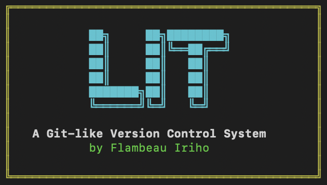

## Introduction

Every day, millions of developers push, pull, and merge code without thinking twice. But underneath Git's familiar commands lies one of the most elegant distributed systems ever built: a system that solves problems like data consistency, conflict resolution, and partition tolerance in ways that would make any distributed systems engineer proud.

**Lit** is my implementation of Git's core features from scratch in Python. Building it taught me more about distributed systems than any textbook could. This post explores how version control systems embody the fundamental principles of distributed computing.

> "The best way to understand distributed systems is to build one."

---

## The Distributed Systems Problem

Before diving into Lit, let's frame the problem. Distributed version control must solve several classic challenges:

| Challenge | Distributed Systems | Version Control |
|-----------|---------------------|-----------------|
| Ordering Events | How do we know what happened first? | Which commit came before which? |
| Replication | How do we keep copies in sync? | How do clones stay updated? |
| Consistency | When do all nodes agree? | When is a merge "complete"? |
| Partition Tolerance | What if nodes can't communicate? | What if you're offline? |
| Conflict Resolution | What if two nodes disagree? | What if two devs edit the same line? |

Git, and by extension Lit, provides elegant solutions to all of these.

---

## Part I: The Object Model

### Content-Addressable Storage

At Lit's core is a simple but powerful idea: **content-addressable storage**. Every piece of data is stored and retrieved using its SHA-1 hash.

```python
class LitObject(ABC):
    """Base class for all Lit objects."""
    
    def compute_hash(self) -> str:
        """
        Objects are hashed with a header: <type> <size>\0<content>
        The same content always produces the same hash.
        """
        data = self.serialize()
        header = f"{self.type} {len(data)}\0".encode()
        self._hash = hashlib.sha1(header + data).hexdigest()
        return self._hash
```

This design has profound implications for distributed systems:

- **Immutability**: Objects never change. The same content always produces the same hash.
- **Integrity**: Any corruption is immediately detectable. If the hash doesn't match, the data is invalid.
- **Deduplication**: Identical files across the entire history are stored exactly once.
- **Trustless Verification**: Any node can verify data authenticity without trusting the source.

### The Three Object Types

Lit implements three fundamental object types:

**1. Blobs** store raw file content:

```python
class Blob(LitObject):
    """Raw file content, no metadata."""
    
    def __init__(self, data: bytes = None):
        self.data = data or b''
```

**2. Trees** represent directory structures:

```python
class Tree(LitObject):
    """Directory structure: list of (mode, name, hash) entries."""
    
    def __init__(self):
        self.entries: List[TreeEntry] = []
```

**3. Commits** capture snapshots with history:

```python
class Commit(LitObject):
    """Snapshot in time with parent links."""
    
    def __init__(self):
        self.tree: str = ''           # Root tree hash
        self.parents: List[str] = []  # Parent commit hashes
        self.message: str = ''
        self.author_time: int = 0     # Timestamp
```

Together, these form an **immutable, content-addressed data structure**: a foundation that makes the rest of the distributed system possible.

---

## Part II: Ordering Events: The Commit DAG

### The Problem of Time in Distributed Systems

In a centralized system, ordering events is trivial: you have one clock. In a distributed system, each node has its own clock, and clocks can drift. How do we establish ordering?

Traditional distributed systems use **logical clocks**:

- **Lamport Clocks**: A single counter incremented on each event
- **Vector Clocks**: A vector of counters, one per node, tracking causality

Git takes a different approach: the **Directed Acyclic Graph (DAG)**.

### The Commit DAG as a Logical Clock

Each commit in Lit contains pointers to its parent commits:

```python
class Commit(LitObject):
    def __init__(self):
        self.parents: List[str] = []  # Links to parent commits
```

This creates a DAG structure:

```
        A ← B ← C ← D ← G (main, merge commit)
             \         ↗
              E ← F ──┘ (feature)
```

The DAG provides **causal ordering** without synchronized clocks:

- If commit B points to A as a parent, **A happened before B**
- If C and E have no ancestor relationship, they are **concurrent**
- The structure itself encodes the happens-before relationship

### Comparing to Vector Clocks

| Aspect | Vector Clocks | Git DAG |
|--------|---------------|---------|
| Size | O(n) per event, n = nodes | O(k) per commit, k = parents |
| History | Implicit in clock values | Explicit graph structure |
| Concurrency | Compare vectors | Find merge base |
| Visualization | Abstract | Natural branching diagram |

The DAG is essentially a **sparse representation of a vector clock** optimized for version control's access patterns.

### Finding Common Ancestors

To merge two branches, Lit must find their **Lowest Common Ancestor (LCA)**: the most recent commit both branches share:

```python
def find_merge_base(self, commit1: str, commit2: str) -> Optional[str]:
    """
    Find the best common ancestor using BFS.
    This is the merge base, essential for three-way merge.
    """
    if commit1 == commit2:
        return commit1
    
    ancestors1 = self._get_all_ancestors(commit1)
    ancestors2 = self._get_all_ancestors(commit2)
    
    common = ancestors1 & ancestors2
    
    if not common:
        return None  # Unrelated histories
    
    # Find the closest common ancestor
    return self._find_closest(commit1, commit2, common)
```

This LCA is crucial: it tells us what both branches started from, enabling intelligent merging.

---

## Part III: Replication: Clone, Fetch, Push

### Optimistic Replication

Lit uses **optimistic replication**: a strategy where replicas can diverge and reconcile later:

1. **Clone**: Create a complete copy of all data
2. **Work Offline**: Make changes locally without coordination
3. **Push/Pull**: Synchronize changes when ready
4. **Merge**: Reconcile any divergence

This is fundamentally different from **pessimistic replication** (like two-phase commit), which requires coordination before any change.

```python
def clone(self, source_url: str, dest_path: str) -> Repository:
    """
    Clone creates a complete, independent replica.
    No coordination with source required after clone completes.
    """
    # Copy ALL objects: complete history
    for obj_file in source_objects.rglob('*'):
        copy_object(obj_file, dest_repo)
    
    # Copy refs as remote-tracking branches
    for branch in source_branches:
        # refs/heads/main → refs/remotes/origin/main
        create_remote_tracking_ref(branch, dest_repo)
    
    # Set up remote for future sync
    dest_repo.add_remote('origin', source_url)
```

### The Fetch-Merge Protocol

When synchronizing, Lit separates fetching data from integrating it:

```python
def fetch(self, remote: str = 'origin'):
    """
    Download new objects WITHOUT modifying local branches.
    Updates refs/remotes/<remote>/* only.
    """
    url = self.get_remote_url(remote)
    
    # Transfer only missing objects
    for obj_hash in get_remote_objects(url):
        if not self.repo.object_exists(obj_hash):
            download_and_store(obj_hash)
    
    # Update remote-tracking refs
    for branch, commit in get_remote_refs(url):
        self.update_ref(f'refs/remotes/{remote}/{branch}', commit)
```

This separation provides:

- **Safety**: Local work is never overwritten automatically
- **Visibility**: You can inspect remote changes before merging
- **Control**: You decide when and how to integrate

In Lit, this looks like: `lit fetch origin` followed by `lit merge origin/main`.

### Push and Non-Fast-Forward Rejection

```python
def push(self, remote: str, branch: str):
    """
    Upload commits to remote.
    Fails if it would lose commits (non-fast-forward).
    """
    local_hash = self.get_branch_hash(branch)
    remote_hash = self.get_remote_branch_hash(remote, branch)
    
    # Safety check: ensure we're not losing history
    if remote_hash and not self.is_ancestor(remote_hash, local_hash):
        raise Exception(
            "Non-fast-forward push rejected. "
            "Pull and merge first."
        )
    
    # Transfer missing objects
    missing = self.find_missing_objects(local_hash, remote_hash)
    for obj_hash in missing:
        upload_object(obj_hash)
    
    # Update remote ref
    update_remote_ref(remote, branch, local_hash)
```

This rejection of non-fast-forward pushes prevents **lost updates**: a critical property in distributed systems.

---

## Part IV: Consistency Models

### The CAP Theorem Perspective

The CAP theorem states that a distributed system can provide at most two of:

- **Consistency**: All nodes see the same data
- **Availability**: Every request gets a response
- **Partition Tolerance**: System works despite network failures

**Where does Lit/Git fall?**

| Property | Lit's Approach |
|----------|----------------|
| Consistency | ❌ Eventual, replicas can diverge |
| Availability | ✅ All operations work offline |
| Partition Tolerance | ✅ Designed for disconnected operation |

Lit is an **AP system**: it prioritizes Availability and Partition Tolerance, accepting eventual consistency.

### Eventual Consistency Through Merge

Git achieves **eventual consistency** through its merge operation:

```python
def merge(self, branch_name: str) -> MergeResult:
    """
    Merge is the consistency mechanism.
    After merge, both branches reflect all changes.
    """
    theirs = self.resolve_ref(branch_name)
    ours = self.repo.refs.resolve_head()
    base = self.find_merge_base(ours, theirs)
    
    # If we're already up-to-date
    if base == theirs:
        return MergeResult(message="Already up to date")
    
    # Fast-forward if possible
    if base == ours:
        return self.fast_forward(theirs)
    
    # Three-way merge required
    return self.three_way_merge(base, ours, theirs)
```

This model accepts that:
1. Replicas can diverge (during disconnected work)
2. Divergence is explicitly reconciled (through merge)
3. After reconciliation, consistency is restored

### Strong vs. Eventual: A Trade-off

| Aspect | Strong Consistency | Eventual (Git) |
|--------|-------------------|----------------|
| Latency | High (coordination) | Low (local ops) |
| Availability | Limited during partitions | Always available |
| Complexity | Simpler mental model | Must handle divergence |
| Use Case | Banking, inventory | Collaborative dev |

For collaborative software development, eventual consistency is the right choice: developers need to work independently, and merge conflicts are a natural part of the workflow.

---

## Part V: Conflict Resolution: The Three-Way Merge

### The Core Algorithm

When two developers modify the same file, Lit must decide what to do. The **three-way merge** algorithm compares three versions:

1. **Base**: The common ancestor
2. **Ours**: The current branch
3. **Theirs**: The branch being merged

```python
def three_way_merge_file(self, base: bytes, ours: bytes, theirs: bytes) -> Tuple[bytes, bool]:
    """
    Merge a single file using three-way merge.
    Returns (merged_content, had_conflicts).
    """
    # Case 1: Same in both, no conflict
    if ours == theirs:
        return ours, False
    
    # Case 2: Only we changed it
    if base == theirs:
        return ours, False
    
    # Case 3: Only they changed it
    if base == ours:
        return theirs, False
    
    # Case 4: Both changed, need line-by-line merge
    return self._merge_lines(base, ours, theirs)
```

### Conflict Detection

When both branches modify the same lines differently, Lit detects a conflict:

```python
def _merge_lines(self, base: bytes, ours: bytes, theirs: bytes) -> Tuple[bytes, bool]:
    """Line-by-line merge with conflict detection."""
    
    base_lines = base.decode().splitlines(keepends=True)
    ours_lines = ours.decode().splitlines(keepends=True)
    theirs_lines = theirs.decode().splitlines(keepends=True)
    
    result = []
    has_conflicts = False
    
    for base_line, our_line, their_line in align_lines(base_lines, ours_lines, theirs_lines):
        if our_line == their_line:
            result.append(our_line)
        elif base_line == their_line:
            result.append(our_line)  # We changed it
        elif base_line == our_line:
            result.append(their_line)  # They changed it
        else:
            # Both changed differently: CONFLICT
            has_conflicts = True
            result.extend([
                "<<<<<<< HEAD\n",
                our_line,
                "=======\n",
                their_line,
                ">>>>>>> theirs\n"
            ])
    
    return ''.join(result).encode(), has_conflicts
```

### Why Three Versions?

Without the base, you can't distinguish between:

- "A changed X to Y, B kept X" (take Y)
- "A changed X to Y, B changed X to Z" (conflict!)

The base provides **context** for intelligent merging: this is why merge bases matter. In Lit, you can even auto-resolve conflicts with `lit merge feature --auto`.

---

## Part VI: Consensus Without Coordination

### The Illusion of Agreement

Traditional distributed systems achieve consensus through protocols like **Paxos** or **Raft**, requiring multiple rounds of communication. Lit achieves something remarkable: **the appearance of consensus without real-time coordination**.

How? Through **deterministic merge semantics**:

```python
# If DevA and DevB both merge the same branches...
devA: merge(feature, main)  # → produces commit X
devB: merge(feature, main)  # → produces commit X'

# X and X' will have:
# Same tree (same file contents)
# Same parents (same history links)
# Different hashes (different timestamps/authors)
```

The resulting **content** is identical, even without communication. The merge algorithm is deterministic given the same inputs.

### CRDT-like Properties

Git's object model shares properties with **Conflict-Free Replicated Data Types (CRDTs)**:

| Property | Git Implementation |
|----------|-------------------|
| Commutativity | Merge order doesn't affect content |
| Associativity | (A merge B) merge C = A merge (B merge C) |
| Idempotency | Merging same branch twice is safe |

```python
# Commutativity demonstration:
merge(A, B)  # Same content as...
merge(B, A)  # this (different commit hash, same tree)

# Idempotency demonstration:
merge(feature)
merge(feature)  # Second merge is a no-op
```

These properties ensure that **regardless of synchronization order**, replicas converge to the same state.

---

## Part VII: Advanced Operations

### Stash: Local State Management

The stash saves uncommitted work without creating a commit on any branch. Running `lit stash` saves your changes and cleans the working directory:

```python
class StashManager:
    def push(self, message: str = None) -> StashEntry:
        """Save working directory and index state."""
        
        # Capture current state as trees
        index_tree = self._build_tree_from_index()
        work_tree = self._build_tree_from_working_dir()
        
        entry = StashEntry(
            message=message or f"WIP on {branch}",
            branch=self.get_current_branch(),
            commit=self.repo.refs.resolve_head(),
            index_tree=index_tree,
            work_tree=work_tree,
            timestamp=int(time.time())
        )
        
        # Save to stash stack
        self._push_to_stack(entry)
        
        # Reset working directory
        self._reset_to_head()
        
        return entry
```

### Rebase: Rewriting History

Rebase replays commits on top of a new base, creating **new commits with the same changes**:

```python
def rebase(self, upstream: str):
    """Replay commits on a new base."""
    
    onto = self.resolve_ref(upstream)
    head = self.repo.refs.resolve_head()
    base = self.find_merge_base(onto, head)
    
    # Get commits to replay (base..HEAD)
    commits = self.get_commits_between(base, head)
    
    # Move HEAD to the new base
    self.reset_hard(onto)
    
    # Replay each commit
    for commit_hash in commits:
        original = self.repo.read_object(commit_hash)
        
        # Apply changes from this commit
        changes = self.get_commit_changes(commit_hash)
        self.apply_changes(changes)
        
        # Create new commit with same message
        new_hash = self.create_commit(
            message=original.message,
            author=original.author
        )
```

**Before rebase:**
```
        A ← B ← C (main)
             \
              D ← E (feature)
```

**After `lit rebase main` on feature:**
```
        A ← B ← C (main)
                 \
                  D' ← E' (feature)
```

D' and E' are **new commits**: same changes, different hashes, different parents.

---

## Part VIII: The Architecture

### Layered Design

Lit follows a clean separation of concerns:

```
┌─────────────────────────────────────────────────────────────┐
│                        CLI Layer                             │
│    init │ add │ commit │ branch │ merge │ fetch │ push      │
└────────────────────────────┬────────────────────────────────┘
                             │
┌────────────────────────────▼────────────────────────────────┐
│                    Operations Layer                          │
│        DiffEngine │ MergeEngine │ StashManager               │
└────────────────────────────┬────────────────────────────────┘
                             │
┌────────────────────────────▼────────────────────────────────┐
│                       Core Layer                             │
│    Repository │ Objects │ Index │ Refs │ RemoteManager      │
└────────────────────────────┬────────────────────────────────┘
                             │
┌────────────────────────────▼────────────────────────────────┐
│                     Storage Layer                            │
│              .lit/ directory (filesystem)                    │
└─────────────────────────────────────────────────────────────┘
```

### Repository Structure

```
.lit/
├── objects/           # Content-addressable object database
│   ├── ab/           # Sharded by first 2 hex chars
│   │   └── cdef...   # Compressed object data
│   └── ...
├── refs/
│   ├── heads/        # Local branches
│   │   └── main      # → commit hash
│   ├── tags/         # Tags
│   └── remotes/      # Remote-tracking branches
│       └── origin/
│           └── main
├── HEAD              # Current branch reference
├── index             # Staging area (binary format)
└── config            # Repository configuration
```

---

## Conclusion: What Building Lit Taught Me

### The Elegance of Git's Design

Building a version control system from scratch revealed the brilliance of Git's architecture:

1. **Content-addressable storage** solves integrity, deduplication, and verification in one elegant abstraction

2. **The commit DAG** provides causal ordering without synchronized clocks: a distributed systems problem solved through data structure design

3. **Three-way merge** enables automatic conflict resolution by preserving context through the merge base

4. **Optimistic replication** with explicit merge gives developers freedom while maintaining consistency

### Distributed Systems Principles in Practice

| Concept | How Git/Lit Implements It |
|---------|---------------------------|
| Logical Clocks | Commit DAG encodes happens-before |
| Replication | Clone creates full replicas |
| Consistency | Eventual consistency via merge |
| Partition Tolerance | Full offline operation support |
| Conflict Resolution | Three-way merge with user intervention |
| Consensus | Deterministic merge = same result |

### Try It Yourself

Lit implements 27 Git commands and is designed for learning. Check out the [Quick Example on GitHub](https://github.com/firiho/lit#quick-example-merge-conflict--auto-resolution) for a hands-on walkthrough of merge conflicts and auto-resolution.

Building your own VCS is one of the best ways to understand both Git and distributed systems. The concepts transfer directly to distributed databases, consensus protocols, and any system where multiple nodes must agree on shared state.

---

## Resources

- [Lit on GitHub](https://github.com/firiho/lit): Full source code with 358 tests
- [Pro Git Book](https://git-scm.com/book/en/v2): Comprehensive Git guide
- [Git Internals](https://git-scm.com/book/en/v2/Git-Internals-Plumbing-and-Porcelain): Deep dive into Git's plumbing

---

*Lit is an educational project demonstrating distributed systems principles. For production use, please use Git.*
